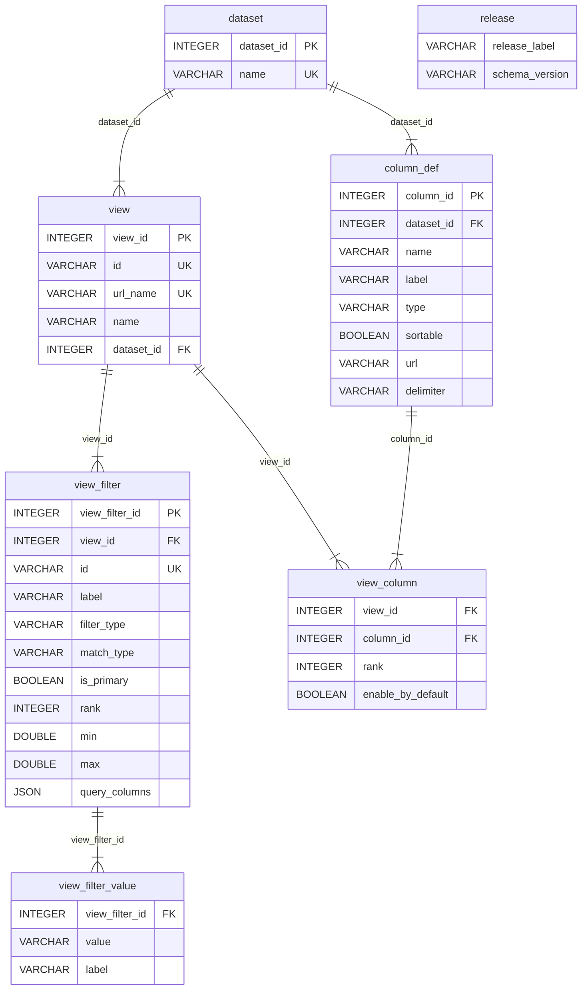

# Data portal ETL v2

A tool for generating data portal release databases. It validates configuration, transforms source CSVs, and produces a self-contained DuckDB database ready for use by Ensembl data portals such as the AMR Portal and similar.

## Requirements

- Python >= 3.12
- [uv](https://docs.astral.sh/uv/) (recommended)

## Installation

```bash
uv sync
```

For YAML configuration support:

```bash
uv sync --extra yaml
```

## Usage

```
usage: main.py [-h] -r RELEASE -c CONFIG -d DATA [--schema SCHEMA] [-f] [-v]
```

| Argument | Required | Description |
|----------|----------|-------------|
| `-r`, `--release` | Yes | Release name (used as the output directory and database name) |
| `-c`, `--config` | Yes | JSON (or YAML) file describing views, filters, and column overrides |
| `-d`, `--data` | Yes | JSON (or YAML) file describing datasets and their source CSVs |
| `--schema` | No | Directory containing JSON Schema files for validation. Defaults to `schema/` |
| `-f`, `--force` | No | Overwrite an existing release directory if present |
| `-v`, `--verbose` | No | Enable debug-level logging |

### Example

```bash
uv run python main.py -r example_v1 -c example/config.json -d example/data.json
```

## Pipeline stages

1. **Validate configurations** -- config and data JSON files are validated against their JSON schemas and parsed into Pydantic models
2. **Transform datasets** -- source CSVs are loaded, filtered, and any generated columns are created
3. **Process dataset metadata** -- column definitions are extracted per dataset, applying any overrides from the `columns` configuration (labels, types, visibility, sorting)
4. **Precompute filter values** -- for `select_list` filters, distinct values and labels are computed from the dataset
5. **Build configuration database** -- metadata tables (dataset, column_def, view, view_filter, view_filter_value, view_column, release) are written to DuckDB
6. **Load data** -- transformed dataset CSVs are loaded into DuckDB as their own tables

## Configuration

See [CONFIG_README.md](CONFIG_README.md) for full documentation of `config.json` and `data.json`.

## Development

Install dev dependencies:

```bash
uv sync --group dev
```

### Testing

```bash
uv run pytest
```

Tests live under `tests/` and use shared fixtures defined in `tests/conftest.py`.

### Linting and formatting

```bash
# Format code
uv run black etl/ tests/

# Sort imports
uv run isort etl/ tests/

# Lint with ruff
uv run ruff check etl/ tests/

# Type checking
uv run mypy etl/
```

Ruff can also auto-fix issues:

```bash
uv run ruff check --fix etl/ tests/
```

## DuckDB schema



The schema also includes two convenience views:

- **filter_config** -- joins `view_filter`, `view`, and `dataset` to provide a denormalised view of all filter settings per view
- **column_config** -- joins `view_column`, `view`, `dataset`, and `column_def` to provide a denormalised view of all column metadata per view
